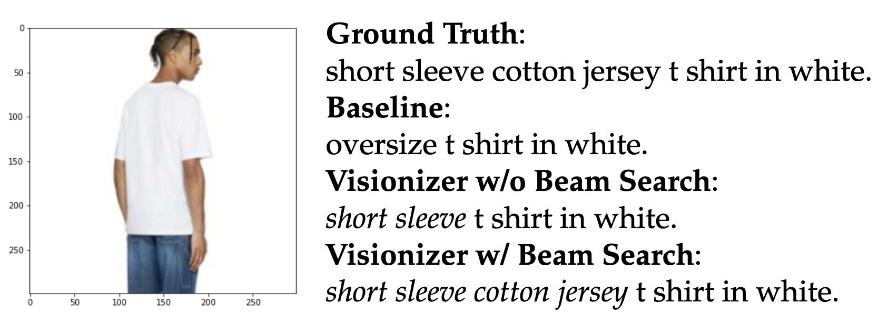
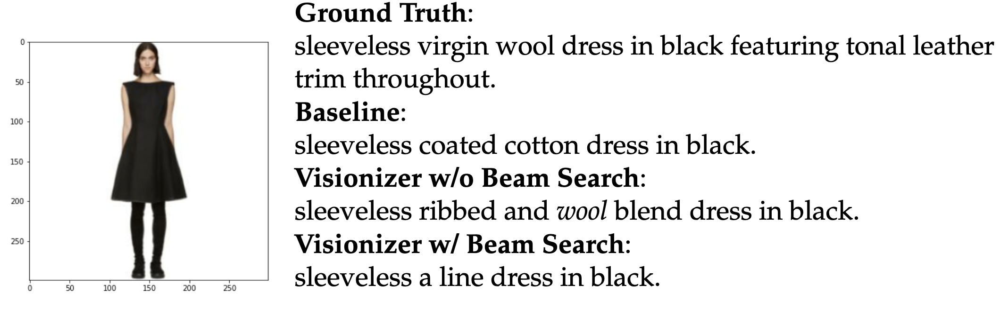

# Visionizer

  

Platforms for fashion e-commerce are rising in popularity. However, the majority of the manual work still goes into scanning, rendering, and captioning fashion products. The task of creating a textual description of a fashion item from a photograph depicting it is covered in this research on fashion image captioning. For this work, we create the FashionCap dataset, which consists of 40,000 captions for over 290,000 photos and it is based on the original counterpart FashionGen. We conduct a thorough analysis using several neural architectures on three fashion captioning datasets.

## Datasets

The following datasets were used, and are available here: [https://doi.org/10.5281/zenodo.7196078](https://doi.org/10.5281/zenodo.7196078)
* FashionCap
* ReducedFACAD
* ReducedInFashAI

## Dependencies  
* tensorflow
* numpy
* pandas
* nltk
* bert_score
* matplotlib
* tqdm
* numba

## Best BLEU score output w/o Beam Search 

  

## Worst BLEU score output w/o Beam Search 

  

## Attention Weights during generation

  

